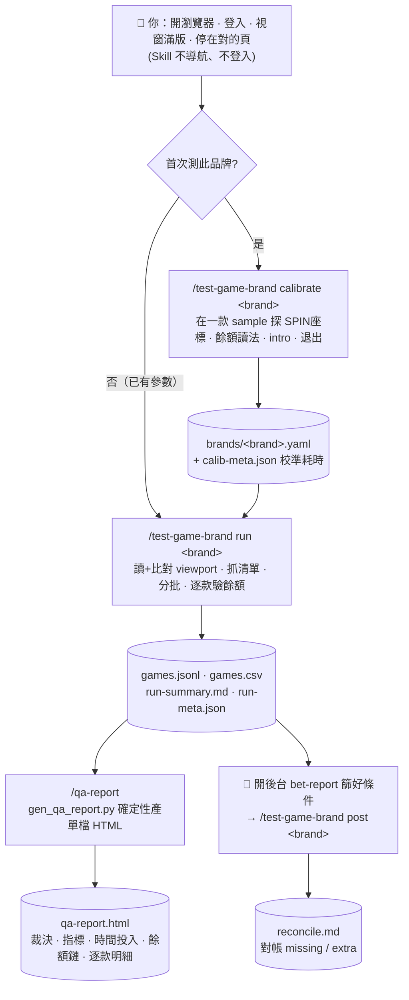

# casino-game-testing

面向第三方電子遊戲平台的**批次測試自動化**。把先前手做的測試流程抽象成可重用的 Skill + Subagent，整組 QA（Win/Mac/Linux/WSL）共用同一份 repo。

兩個核心堅持：

- **品牌無預設** — repo 不存任何品牌參數；每個品牌的 SPIN 座標等由 AI 在 `calibrate` 模式自己探出，寫到本機 `brands/<brand>.yaml`（gitignored）。
- **站點無預設** — repo 不存帳號/網址；**使用者自己開瀏覽器、登入、停在對的頁面**，Skill 從當前頁接手。**Skill 不導航、不登入**，只做「批次驅動 + 餘額驗證 + 報告產出」。

---

## QA 上手 5 步

1. `git clone` 此專案，然後 `cp .mcp.json.example .mcp.json`（`.mcp.json` 是本機檔、不入 repo）。
2. 在專案資料夾啟動 Claude Code → MCP 自動裝/跑 → **Chromium 視窗自動跳出**。
   - ⚠️ **不同 OS 可能要改 `.mcp.json`**，見下方「跨平台注意」。
3. **你自己**：把 Chromium 視窗**拉到滿版**（座標靠滿版維持一致，過程中別改視窗大小），登入站點、進到對應品牌的遊戲列表頁。
4. 在 Claude Code 輸入：
   - 首次跑某品牌 → `/test-game-brand calibrate <brand>`（先校準參數）
   - 已有參數 → `/test-game-brand run <brand>`（批次跑）
5. 跑完，自己開後台 bet-report 篩好條件 → `/test-game-brand post <brand>`（對帳）。

---

## ⚠️ 跨平台安裝（不同 OS 的 QA 必讀）

repo 只 track 一份通用範本 `.mcp.json.example`（不寫死任何路徑）。實際用的 `.mcp.json` 是**本機檔、已 gitignore**，所以每個人的本機路徑（含使用者名稱）都不會被 commit。clone 後：

```bash
cp .mcp.json.example .mcp.json   # 之後只改這份本機檔
```

### 前置：Node.js（必裝）
整套 MCP 是用 `npx` 啟動的（見 `.mcp.json`），所以**一定要有 Node.js**。沒有就先裝（建議用 nvm，或各 OS 官方安裝包）。裝完確認：
```bash
node -v && npx -v      # 兩個都印得出版本才算 OK
```

> 🔴 **千萬別 `sudo npx ...`**：若 Node 是用 **nvm** 裝的，它在你家目錄、只在「你自己的 shell」進 PATH。一加 `sudo`，PATH 被重設、nvm 不見 → 報 `npx: command not found`。
> 正解：**npx 用你自己的身分跑**，需要動 apt 時讓工具**自己跳 sudo 密碼**。真的非 sudo 跑 npx 不可，用 `sudo env "PATH=$PATH" npx ...` 把 PATH 帶進去。

### 裝 Chromium（瀏覽器本體，免 sudo）
```bash
npx playwright install chromium      # 下載到 ~/.cache/ms-playwright/（不要加 sudo）
```

### 裝系統依賴（只有 Linux / WSL 需要）
macOS、原生 Windows **跳過這步**。Linux/WSL 上 Chromium 缺 shared library 會「視窗跳不出來」：

| 發行版 | 指令 |
|--------|------|
| **Debian / Ubuntu / WSL** | `npx playwright install --with-deps chromium`（不加 sudo 前綴，工具會自己跳 sudo 裝 apt）<br>或手動：`sudo apt-get install -y libpango-1.0-0 libpangocairo-1.0-0 libgbm1 libasound2 libxkbcommon0 libatk-bridge2.0-0 libatspi2.0-0 libcups2 libnss3 libnspr4` |
| **Fedora / RHEL** | `--with-deps` 不支援；用 `sudo dnf install` 對應 lib（`nss atk at-spi2-atk cups-libs libdrm libxkbcommon mesa-libgbm pango alsa-lib`） |
| **Arch** | `sudo pacman -S nss atk at-spi2-atk libcups libdrm libxkbcommon mesa pango alsa-lib` |

> 套件**版本號不重要**，有裝就好；名稱會隨發行版不同。

### 中文站點字型（繁中/簡中站必裝，否則文字變方塊 □）
| 發行版 | 指令 |
|--------|------|
| **Debian / Ubuntu / WSL** | `sudo apt-get install -y fonts-noto-cjk fonts-noto-cjk-extra && fc-cache -f` |
| **Fedora** | `sudo dnf install google-noto-sans-cjk-fonts google-noto-serif-cjk-fonts` |
| **Arch** | `sudo pacman -S noto-fonts-cjk` |
| **macOS / Windows** | 系統內建中文字型，通常免裝 |

### WSL 補一步：在 `.mcp.json` 指定 Chromium 路徑
WSL 上 playwright MCP 預設會去找系統 chrome（沒裝），要明確指向剛剛 `npx playwright install` 下載的 binary：

```jsonc
"args": ["-y", "@playwright/mcp@latest", "--browser", "chromium",
         "--config", "./playwright-mcp.config.json",
         "--executable-path", "<你的本機 chromium 路徑>"]
//                              ↑ 範例：$HOME/.cache/ms-playwright/chromium-<版本>/chrome-linux64/chrome
//                                版本號用  ls ~/.cache/ms-playwright/  查自己機器的
```
macOS / Windows / 一般 Linux 桌面通常**不用加** `--executable-path`，範本原樣即可。

> 改完 `.mcp.json` 要**重啟 Claude Code** 才生效。`.mcp.json` 已 gitignore，是各人本機檔，改它不會影響別人。

### Python 環境（uv）— 報告產生器用
QA 報告產生器（`.claude/skills/qa-report/gen_qa_report.py`、`gen_detail_only.py`）跑在**專案獨立的 `.venv`（Python 3.13）**，用 [uv](https://docs.astral.sh/uv/) 管理（新世代工具，pip/venv/pyenv 合一、免 sudo 就能裝任意 Python 版本）。

```bash
# 1) 裝 uv（user 層、免 sudo；裝到 ~/.local/bin）
curl -LsSf https://astral.sh/uv/install.sh | sh
export PATH="$HOME/.local/bin:$PATH"          # 這行可加進 ~/.bashrc

# 2) clone 後建環境（讀 .python-version + pyproject.toml，需要時自動下載 Python 3.13）
uv sync

# 3) 跑產生器
uv run .claude/skills/qa-report/gen_qa_report.py <report_dir> --input <…>/qa-report-input.json
uv run .claude/skills/qa-report/gen_detail_only.py <report_dir> --names <對照>.json --out <out>.html
```

- **版本管理**：`pyproject.toml`（`requires-python`）、`uv.lock`、`.python-version` 都已 commit，團隊環境一致可重現；`.venv/` 不入 repo。
- **目前零第三方依賴**（純標準庫）；未來要寫 `.xlsx` / 接 Google Sheets API 時 `uv add openpyxl` / `uv add gspread` 即可。
- 無 uv 時可退回 `python3 <script>`（腳本純標準庫，任何 Python 3 皆可跑）。

### 安全防線：進版前敏感掃描（clone 後一次性啟用）
避免把本機路徑、密碼/token/金鑰、或誤加的敏感檔（截圖 / `reports/` / `.mcp.json` / `brands/<brand>.yaml`）commit 進 repo。

```bash
git config core.hooksPath hooks        # 啟用 pre-commit 掃描（每個 clone 各做一次）
bash scripts/secret-scan.sh --all      # 想手動全庫體檢時
```

- 啟用後每次 `git commit` 會自動跑 `scripts/secret-scan.sh` 掃暫存區，命中就擋下。
- `/git-commit` skill 也會在提交前先掃一次。
- 確認為誤判可 `git commit --no-verify` 略過（請先人工確認）。
- ⚠️ 掃描器抓不到「站點/帳號/品牌被硬編進通用程式或文件」這種（值合法、但不該入 repo）——這類靠 code review 與 CLAUDE.md 核心不變量把關。

---

## Skill `/test-game-brand` 三個 mode

唯一必填參數是**品牌名**（站點隱含於你準備好的當前頁面）。

| Mode | 你要先停在哪 | Skill 做什麼 |
|------|-------------|-------------|
| `calibrate <brand>` | 開好「一款」sample 遊戲 | 探出 SPIN 座標 / 介紹頁 / bet / OOPS pattern → 寫 `brands/<brand>.yaml` |
| `run <brand>` | 停在該品牌的遊戲列表頁 | 讀當前 URL（記為 lobby）→ 抓遊戲清單 → 切批 → 跑 → 驗餘額 → 出報告 |
| `post <brand>` | 開後台 bet-report、篩好條件 | 讀當前頁 → 對帳 `games.jsonl` → 寫 `reconcile.md` |

擴充 flag：`--range a-b`、`--resume-from g042`、`--retry-oops`、`--dry-run`。

---

## 流程總覽（Workflow）

整條測試流水線：**你手動準備頁面 → calibrate（首次）→ run → qa-report →（可選）post 對帳**。Skill 只從你開好的當前頁接手。



> 🔴 **貫穿全流程的鐵則**：① 驗到餘額變化才能 PASS（`delta==0` 不准）② 視窗滿版、全程不 `resize`，viewport 不符就 fail-fast ③ 卡住/60s 無回應就開新分頁從 lobby 重啟 ④ 品牌無預設、站點無預設，Skill 不導航不登入。詳見下方〈鐵則〉與 [`docs/architecture-plan.md`](docs/architecture-plan.md) 的詳細流程圖。

---

## 鐵則

- 🔴 **驗餘額才能 PASS** — 只 click SPIN 不驗餘額會誤報。`delta == 0` 一律不准標 PASS，要標 `SPIN_NO_DELTA`。先前 247 款裡有 65 款就是這樣假 PASS（實際只 72.5% 真落單）。
- 🔴 **卡住換新分頁** — 任何不可恢復的卡死、或 60s 無回應，直接開新 tab 從 lobby URL 重啟，不在原分頁 debug，該款標 `STUCK_RECOVERED`。
- 🔴 **滿版、不 resize** — 座標靠瀏覽器滿版維持一致；工具**一律不呼叫 `browser_resize`**（程式 resize 有顯示問題）。viewport 只「讀+比對」，跟校準時不符就 fail-fast。跑前把視窗滿版、過程別動。

---

## 實作進度

完整架構與分步計畫見 [`docs/architecture-plan.md`](docs/architecture-plan.md)。

- ✅ Step 1 / 1.5 — 專案骨架 + 架構修正
- ✅ Step 2 — 跨平台 `.mcp.json` + 權限 + 本 README
- ✅ Step 3 — `brands/_schema.yaml` + `_template.yaml`
- ✅ Step 4–5 — `game-batch-runner` subagent + `run` mode（核心，待 live 驗收）
- ✅ Step 6 — `backoffice-reconciler` + `post` mode（待 live 驗收）
- ✅ Step 7 — `brand-calibrator` + `calibrate` mode（半互動，待 live 驗收）
- ⏸ Step 8 — 全量壓測
