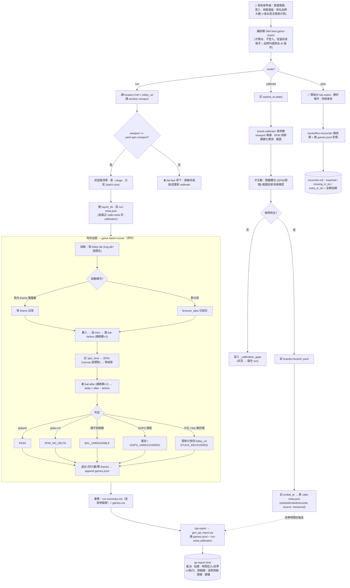

# casino-game-testing — Skill + Subagent 自動化第三方電子遊戲平台批次測試

## Context

先前已在舊專案（外部、不入本 repo）完成某品牌全 247 款測試（覆蓋率 99.6%）。流程已驗證可行，但測試邏輯散在臨時對話與 ad-hoc 操作中，**新品牌要重新一輪手做**。

本專案目標：把流程抽象成可重用的 Skill + Subagent，但**保持「品牌無預設、站點無預設」**：
- **brand 參數**（SPIN 座標等）：由 AI 在 calibrate 模式產生，寫到本機 `brands/<brand>.yaml`（gitignored）
- **站點與帳號**：使用者自己開瀏覽器、登入、建議停在該品牌遊戲大廳（另開好後台投注報表分頁），Skill 從當前頁面接手
- **Skill 不跨站不登入**：品牌內選款/進入/退出遊戲、同站內品牌切換由 AI 操作（切換前宣告）；只做「批次驅動 + 餘額驗證 + 報告產出」

QA 整組（Win/Mac/Linux/WSL）共用同一份 repo；跨平台 MCP 自啟 Chromium，不依賴 9225 port 轉發。

關鍵歷史教訓：先前 65 款翻車是因 agent click SPIN 後沒驗證餘額變化就回報 PASS。新架構必須在 subagent 內強制驗餘額（單一可靠成功判定）。

## 核心設計原則

| 原則 | 表現 |
|------|------|
| 品牌無預設 | repo 不存任何 brand yaml 種子；calibrate 才產生；產出在 `brands/`（gitignored） |
| 站點無預設 | repo 無 `sites/`、無 `.env`；每次跑由使用者開瀏覽器準備好狀態 |
| Skill 不跨站不登入 | 使用者建議停在品牌大廳；品牌內選款/進入遊戲、同站品牌切換由 AI 操作（先宣告）；不在目標站點/未登入才停下 |
| 跨平台 | `.mcp.json` 不寫死 CDP URL；MCP 自啟 Chromium |
| 驗餘額才能 PASS | subagent 強制流程 BEFORE → SPIN → AFTER → delta check；無 delta 不准 PASS |
| 卡住換新分頁 | 60s 無回應就觸發；新 tab 用 run 開始時記下的 lobby URL |

## 架構

### 端到端流程（詳細）

涵蓋分支：viewport fail-fast、啟動模式偵測（頁內 iframe／新分頁）、每款驗 delta 的各 status、卡住換新分頁、以及校準耗時的記錄與呈現。



🔴 圖中粗節點即四大鐵則落點：**RVP**（滿版/viewport fail-fast）、**GV**（驗餘額才 PASS）、**GS**（卡住換新分頁）、**PREP/SK**（品牌·站點無預設、不導航不登入）。

### 資料夾結構

```
~/project/casino-game-testing/
├── README.md                              # QA 上手 5 步
├── .gitignore                             # brands/*.yaml、reports/、tmp/、settings.local.json
├── .mcp.json                              # playwright + chrome-devtools，不寫死 CDP URL
├── .claude/
│   ├── settings.json                      # 團隊共用 hooks（禁 resize / 截圖歸位 / hooksPath 自動設定）
│   ├── settings.local.json                # 權限允許（gitignored，每人本機）
│   ├── skills/
│   │   ├── test-game-brand/SKILL.md
│   │   ├── qa-report/                     # SKILL.md + gen_qa_report.py + report_common.py
│   │   │                                  #   + gen_detail_only.py + qa-report-template.html
│   │   └── git-commit/SKILL.md
│   └── agents/                            # 四個 subagent
│       ├── game-batch-runner.md
│       ├── brand-calibrator.md
│       ├── backoffice-reconciler.md
│       └── qa-report-writer.md
├── hooks/pre-commit                        # git hook（呼叫 secret-scan；core.hooksPath=hooks）
├── scripts/
│   ├── secret-scan.sh                      # 進版前敏感掃描
│   └── claude-hooks/                       # Claude Code PreToolUse/SessionStart hook 腳本
├── brands/
│   ├── _schema.yaml                       # 欄位定義（git track，給 AI 對照）
│   └── _template.yaml                     # 空白範本（git track）
│   # brands/<brand>.yaml                   # AI 校準產出（gitignored）
├── docs/
│   ├── architecture-plan.md
│   └── acceptance-fixtures.md             # 歷史驗收基準（具體品牌/數值集中在這）
├── pyproject.toml / uv.lock / .python-version   # uv 管的 Python 3.13 環境（零第三方依賴）
└── reports/<brand>-<YYYYMMDD-HHMM>/        # 全 gitignored
    ├── run-summary.md
    ├── games.jsonl / games.csv / full-game-list.json / run-meta.json
    ├── reconcile.md / qa-report.html / qa-report-simple.html
    ├── screenshots/g{NNN}-{loaded|bal-before|spin|bal-after}.png
    └── backoffice/
```

### Skill: `test-game-brand`

唯一必填 arg 是 **brand 名**（站點隱含於使用者準備好的當前頁面）。

| Mode | 指令 | 使用者前置動作 | Skill 動作 |
|------|------|---------------|-----------|
| `calibrate` | `calibrate <brand>` | 停在該品牌遊戲大廳 | AI 自挑大廳第一款進入當 sample → 探出 SPIN 座標 / 介紹頁 / bet / OOPS pattern → 寫 `brands/<brand>.yaml` |
| `run` | `run <brand>` | 停在該 brand 的遊戲列表頁 | 讀當前頁 URL（記為 lobby URL）→ 抓遊戲清單 → 切批 → spawn batch-runner → 彙整報告 |
| `post` | `post <brand>` | 開後台 bet-report、篩好條件 | 讀當前頁資料 → 對帳 `games.jsonl` → 寫 `reconcile.md` |

擴充 flag：`--range a-b`、`--resume-from g042`、`--dry-run`。

### 四個 Subagent

**1. `game-batch-runner`** — 批次執行 8-10 款。

每款流程（依 `brands/<brand>.yaml` 設定）：
```
locate img[alt=name].nth(n)  → load (load_timeout_ms)
→ intro click × N  → screenshot loaded
→ BEFORE_BAL = iframe BALANCE
→ click spin.xy → wait settle → AFTER_BAL
→ if OOPS modal: click OK, retry once
→ status = PASS / OOPS_UNRECOVERED / LOAD_FAIL / SPIN_NO_DELTA / STUCK_RECOVERED
→ exit (回到大廳 → 確定)
→ append jsonl 一行
```

**CRITICAL RULE**（[[feedback-spin-per-game]]）：absolutely no PASS without confirmed balance delta。
**Stuck rule**（[[feedback-new-tab-on-stuck]]）：60s 無回應 → 開新 tab 從 run 起始時記下的 lobby URL → 繼續下一款。

**2. `brand-calibrator`** — 跑 1 款 sample，回傳完整 brand yaml。SPIN 找不到時 ±50px 8 方向重試最多 6 次，仍失敗就寫 `_calibration_gaps` 請使用者人工確認，**禁止用 default 偷渡**（65 款翻車根因）。

互動程度已定案：**半互動**（AI 自動探測、關鍵欄位截圖給使用者確認後才寫 yaml；Step 7 敲定）。

**3. `backoffice-reconciler`** — 從**當前已開好的後台 bet-report 頁**讀資料（不導航、不篩選 — 使用者已準備好）。翻頁抓 snapshot → 比對 `games.jsonl`（配對優先序 `betid` 精準 join ＞ `code`/slug ＞ 名稱/語義 ＞ 時間窗最後手段）→ 釘回注單號 → 產 `reconcile.md`（含 missing_in_bo / extra_in_bo 兩張表）。

**4. `qa-report-writer`** — 讀一次 run 的 report_dir，草擬 QA Manager 裁決/建議寫 `qa-report-input.json`，跑 `gen_qa_report.py`（`--variant full|simple`）產單檔 HTML 報告。數字一律由腳本算，AI 只寫敘述。由 `/qa-report` skill 派發。

### Brand config schema（`brands/_schema.yaml`，是文件、不是真資料）

說明每個欄位的意義 + 範例值。calibrate 模式產出的 `brands/<brand>.yaml` 須符合此 schema。欄位類型：

- `schema_version`、`brand`、`display_name`、`game_platform_id`
- `launch`: selector_pattern, use_nth, click_timeout_ms
- `load_timeout_ms`、`post_load_settle_ms`
- `intro`: clicks, click_xy, interval_ms
- `spin`: xy, settle_ms, viewport（鎖定校準時 viewport）
- `balance`: source (iframe/dom), text_pattern (regex), retry_reads
- `bet`: default, unit, step, adjust_method
- `oops`: detect_in, selectors, dismiss_button, retry_after_dismiss, max_retry
- `exit`: parent_trigger, modal_confirm, wait_after_ms
- `batch`: size, parallel_batches

### 跨平台 `.mcp.json`

```jsonc
{
  "mcpServers": {
    "playwright":      { "command": "npx", "args": ["-y", "@playwright/mcp@latest"] },
    "chrome-devtools": { "command": "npx", "args": ["-y", "chrome-devtools-mcp@latest"] }
  }
}
```

對比舊專案：拿掉 `--cdp-endpoint http://<internal-host>:9225`。MCP 自啟 Chromium 視窗，QA 任何 OS 都可用。

QA 上手 5 步：
1. `git clone` 此專案
2. 在專案資料夾啟動 Claude Code（MCP 自動裝/跑）→ Chromium 視窗自動出來
3. **使用者**：在 Chromium 內登入站點、進對應品牌遊戲列表頁（建議同時開好後台投注報表分頁；之後選款/進遊戲由 AI 操作）
4. 在 Claude Code 輸入 `/test-game-brand calibrate <brand>`（第一次跑該 brand；AI 自挑大廳第一款當 sample）或 `run <brand>`
5. 跑完，後台 bet-report 篩好 → `/test-game-brand post <brand>` 對帳（含詳情彈窗遊戲名正面確認）

## 建置歷程（摘要）

骨架/MCP/schema/四 subagent/三 mode 於 **2026-06-03** 全數建成；其後多品牌實測驗收全部通過：
- **calibrate / run / post 皆 live 驗收**：多個第三方品牌（2026-06 Canvas slot 型 247 款重驗全過、slot 型全量 rerun；2026-06-26 異質玩法型全品牌；**2026-07-07 重測 52 款 48 PASS、對帳 48/48 平、詳情 GameName 全掃零配錯**；2026-07-05 再一 slot 型品牌）。逐案期望值見 `docs/acceptance-fixtures.md`。
- 視窗策略定案「**滿版、不 resize**」（viewport=null + --start-maximized；viewport 只讀+比對），並由 `.claude/settings.json` PreToolUse hook 機器強制（resize / 裸檔名截圖一律 deny）。
- 2026-07-07 起：使用者只需停在品牌大廳（品牌內選款/切換由 AI 操作）、run 有 canary 先行與收尾重試、對帳含詳情彈窗遊戲名正面確認、run 產物由 `gen_run_artifacts.py` 確定性產出。

## Critical Files（現況）

- `.claude/skills/test-game-brand/SKILL.md` ＋ `gen_run_artifacts.py`（run 產物產生器）
- `.claude/skills/qa-report/`（SKILL.md、`gen_qa_report.py`、`report_common.py`、`gen_detail_only.py`、模板）
- `.claude/agents/{game-batch-runner,brand-calibrator,backoffice-reconciler,qa-report-writer}.md`
- `brands/_schema.yaml` + `brands/_template.yaml`（實際 brand yaml gitignored）
- `.mcp.json(.example)` + `playwright-mcp.config.json` + `.claude/settings.json`（hooks）+ `scripts/`（secret-scan、claude-hooks）

## 關鍵風險與防呆

- **viewport 一致性**：MCP 自啟 Chromium 預設 viewport 不一定符合 calibrate 時。策略＝**一律滿版**（`viewport=null` + `--start-maximized`），brand yaml 記校準當下 viewport，subagent 起手**只讀+比對、不一致 fail-fast**；`browser_resize` 已被 hook 硬擋
- **假 PASS 防線**：CRITICAL RULE 在 batch-runner prompt 強調「無 balance delta 不准 PASS」
- **stuck tab**：60s 無回應直接開新 tab、navigate 到 run 開始時記下的 lobby URL（[[feedback-new-tab-on-stuck]]）
- **calibrate fallback**：找不到 SPIN 座標時不准用 default 偷渡，必須寫 `_calibration_gaps` 請使用者確認
- **權限隔離**：`settings.local.json` gitignored，避免個人權限污染團隊
- **使用者前置責任**：Skill 不負責跨站導航/登入/後台篩選；使用者跑前停在品牌大廳＋開好後台投注報表分頁即可（品牌內選款/進遊戲由 AI 操作），跑錯頁面 Skill 會 fail-fast（讀 URL 確認模式對不上就停）

## 未決事項

- session 持久化（暫不加 `--user-data-dir`，看實際使用體驗再決定）
